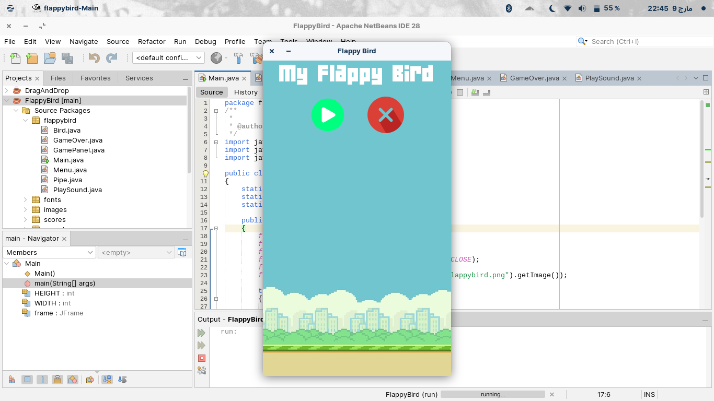
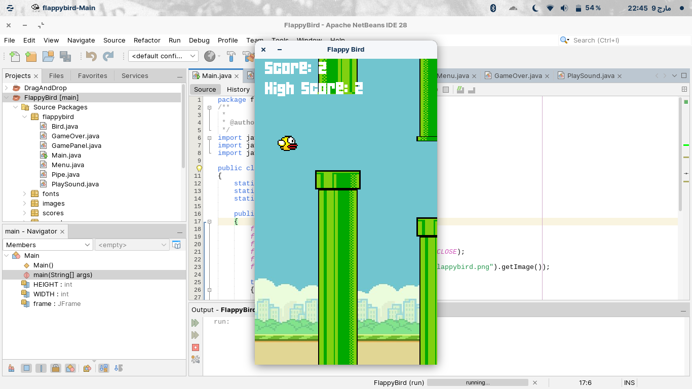
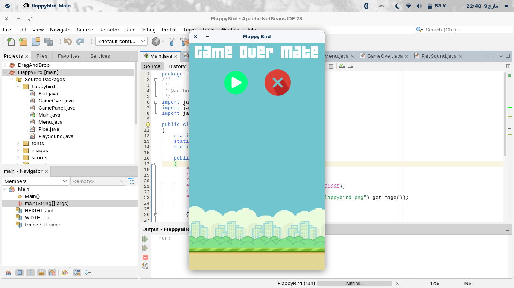

# Flappy Bird in Java (Using Swing API)

It's a simple Flappy Bird clone (written in Java Swing) that I decided to make in my ample time.

The game has a menu panel with two buttons, green for starting the game of course, and red for exiiting the game.



Upon pressing the start button, the game begins. You can use the "space" button to make the bird take a leap.



And upon collision with any of the pipes, the roof or the floor, the game ends.



## How to Run?
### As an Apache NetBeans Project (Recommended)
1. Clone the repo.

   ```git clone https://github.com/Shaheer-Zeb/flappy-bird-in-java.git```
2. Open NetBeans. Click on File > Open Project (Ctrl + Shift + O), and select the cloned repo's folder.
3. Click on the "Run Project" button (F6).

### Manually Compiling and Running (in case you're a maniac)
1. Clone the repo

   ```git clone https://github.com/Shaheer-Zeb/flappy-bird-in-java.git```
2. cd to the "src" folder.

   ```cd src```
  
3. Complile the main class.

   ```javac flappybird/Main.java```
  
4. Run the main class.

   ```java flappybird/Main```

If you encounter issues with manual compilation (e.g. the images not loading), using NetBeans is recommended as the project is structured for it.
